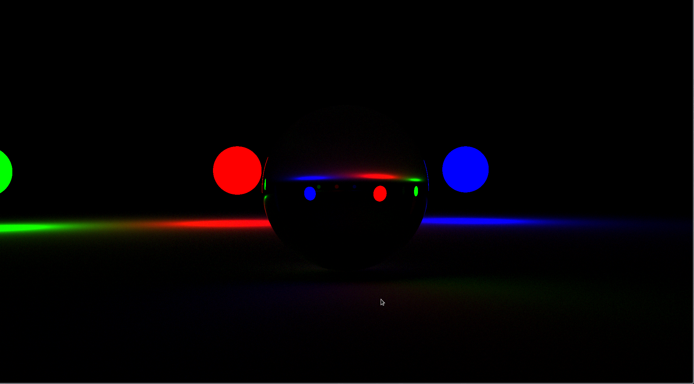
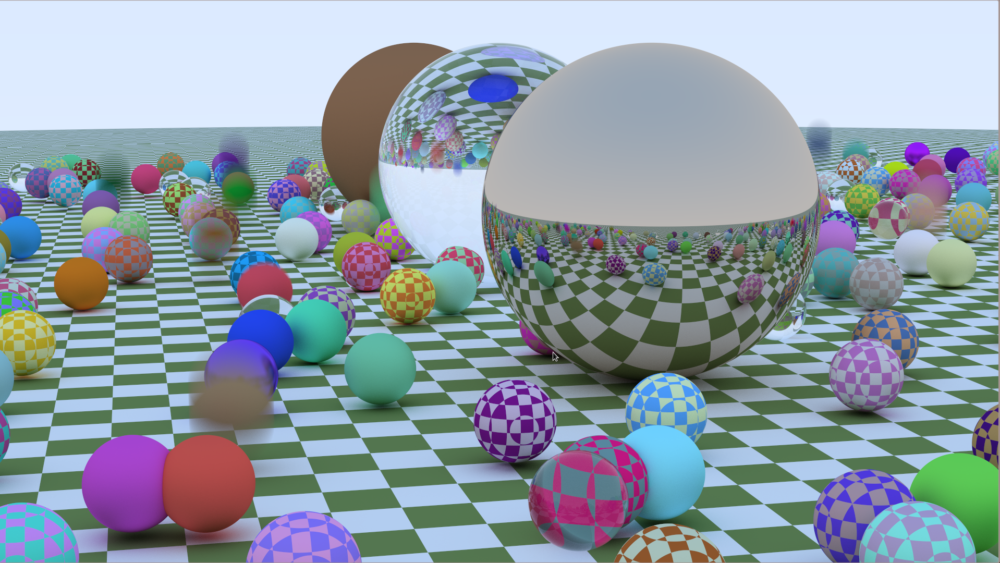
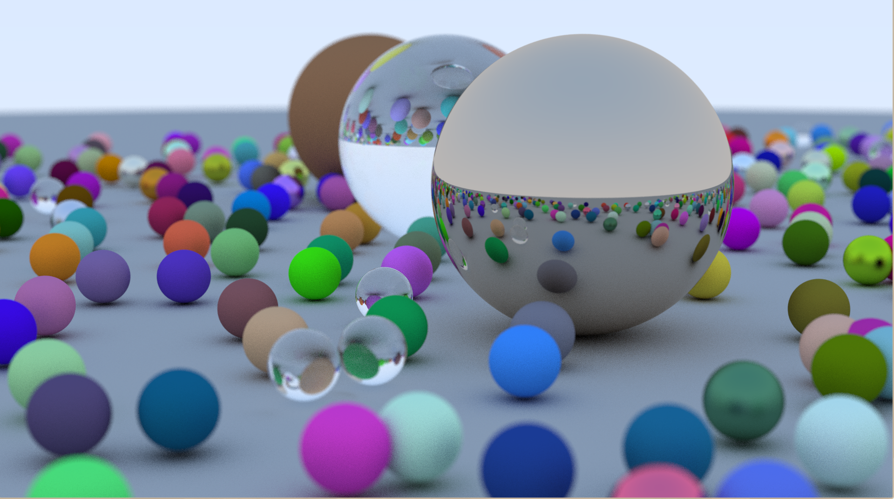

# ANSI C raytracer

A portable simple ANSI C raytracer on CPU !

### (26/08/2021) optimisation + light 

### (26/08/2021) Rendering texture + moving ball + optimisation  

### (25/08/2021) random scene (+ blur)

# doc

- Raytracing in a weekend: 
  - old: [raytracing in a weekend](https://www.realtimerendering.com/raytracing/Ray%20Tracing%20in%20a%20Weekend.pdf)
  - new: [raytracing in a weekend](https://raytracing.github.io/books/RayTracingInOneWeekend.html)

- [Raytracing the next week](https://raytracing.github.io/books/RayTracingTheNextWeek.html#boundingvolumehierarchies)

- [Efficient BVH construction via Approximate Agglomerative Clustering](http://graphics.cs.cmu.edu/projects/aac/aac_build.pdf)
